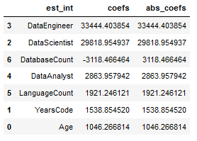
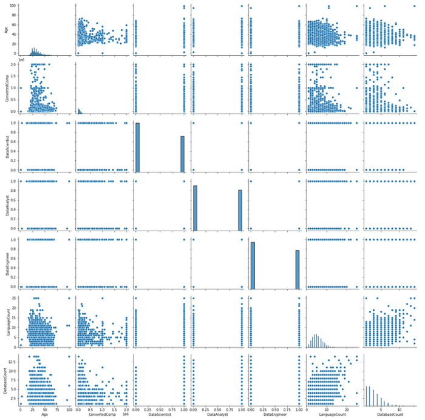
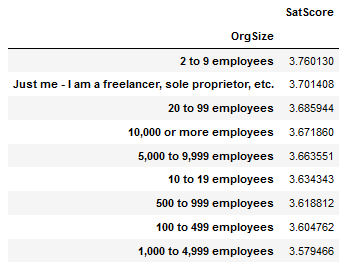
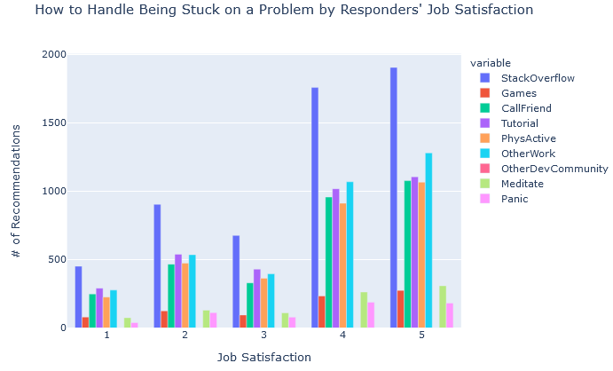

# stack_overflow_2020_data

## Project Motivation

I pulled data from Stack Overflow’s 2020 developer survey to learn a bit more about my career options in data science. The data include a lot of interesting, potentially relevant features, but I decided to focus on information relevant to the following questions:

* How many programming languages should I learn to reach the top-tier data jobs? How many databases? Does it matter?
* Where, in 2020, are the highest paid data scientists/engineers/analysts working?
* Does company size have a noticeable impact on career satisfaction?
* What do the most happily employed data scientists do to get past coding blocks?

## Contents
This repository contains:
* A jupyter notebook containing my data cleaning and analysis code
* The results of the 2020 Stack Overflow developer survey, as well as the survey itself and its README file.

## Libraries
To run the analysis code, you will need the following libraries:
* Pandas
* Numpy
* Plotly
* Scikit-Learn

## Results

### Is salary correlated with breadth of knowledge?

After converting my categorical values to dummy variables, I tried to fit a linear regression to my data. This wasn’t a great fit, as the model’s R2 statistic was below 0.01. Next, I wrote a function to produce a table with the coefficient weights for each of the variables I used in the model.

It looks like the type of data career had the most impact on salary. Surprisingly, the number of programming languages used and the years spent coding professionally were some of the least important predictors. However, I wouldn’t put much stock in this, given the model fit.

Next, I decided to produce a pair plot of the variables to see if I’d missed any relationships between them.

The pair plot array doesn’t show much of a relationship between compensation and any of the variables I selected. However, the number of programming languages known and the number of databases used appear to have a positive correlation, which makes sense.

### Where do the highest paid data scientists work?

[Mean Annual Salary by Country](Images/boxplot.png)

There are some significant outliers in the data, especially for the U.S. (I’ve heard the pay in data science is good, but $2 million annually?). These are likely to be erroneous values.

Overall, while the U.S. does seem to have a slightly higher average salary, the median values across the top five countries aren’t all that different.

### Does company size impact employee happiness?

Averaging the numeric scores (1-5, with 1 as 'very dissatisfied' and 5 as 'very satisfied') by organization size, it actually doesn’t look like there’s much of a pattern here.

### What do the most happily employed data scientists do to get past coding blocks?

The strategies shake out roughly the same for all categories of job satisfaction. Stack Overflow is the most popular tool for solving problems (not surprising, given the source of the survey data). Interestingly enough, none of the respondents used any other developer communities besides Stack Overflow. Meditation seems to be fairly unpopular, but thankfully, so is panicking.

## Acknowledgments

Thanks to everyone who participated in the Stack Overflow Developer Survey for the meaningful insights provided by your experience!